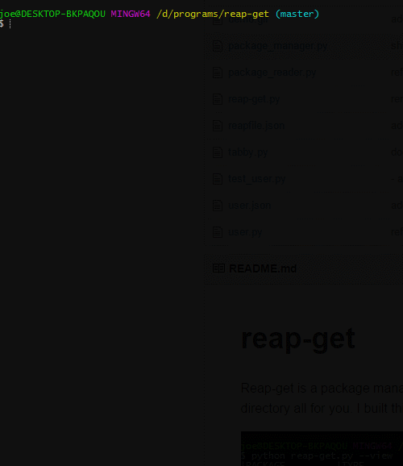

#reap-get

Reap-get is a package manager for VST plugins.
It handles downloading, unzipping and moving the file to your plugin directory all for you. I built this out of my hate for installing plugins. Truly the worst task known to man.



Reap-get comes with a database of packages. 
Follow the instructions below for a brief guide on getting up to speed with it
(tested on Windows 10 and a Debian distribution)


#Example

It's as easy as doing 

```
python reap-get.py --install synth1
```

but for more complete examples of commands, see the [examples doc](docs/examples.md)

#Contributing

If you would like to contribute, please see the [contributing guide](docs/contributing.md) 

#Setup

To see how to install/setup reap-get, checkout the [setup guide](docs/setup.md) 

#Tests

Tests can be ran by `cd`ing to the `src` directory and running 

`python3 -m unittest discover -p 'test_*.py'`

There are also acceptance tests for reap-get, to run these you will need the tool [shelltest](https://github.com/liquidz/shelltest)

Then it's just a case of `shelltest test_cli.txt`

#Reapfiles

A reapfile is a way of automating the installation of multiple plugins.
read more about reapfiles [here](docs/reapfile.md)

#Web

reap-get isn't just a command line utility. There's a web interface to upload your own packages
which can be found at http://reap-get.com
